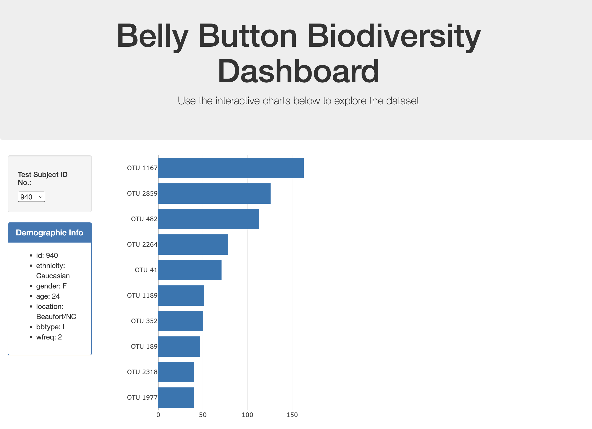
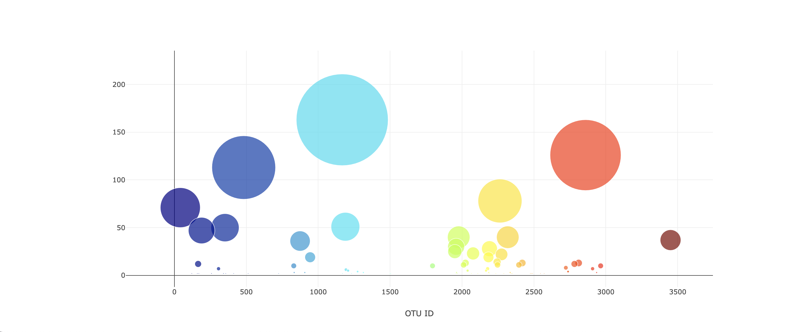

# belly-button-js
An interactive dashboard that explores human belly button biodiversity.

Visit: https://samipete.github.io/belly-button-js/ to interact with the data set.

**About:**
- D3, Javascript and Plotly were used.
- The horizontal bar chart displays the top ten OTUs found in which the Test Subject ID No. selected from the drop down menu.
- The Bubble chart displays each sample for that test subject.
- Demographic info displays the sample metadata aka eachh key-value pair from the metadata JSON object. 